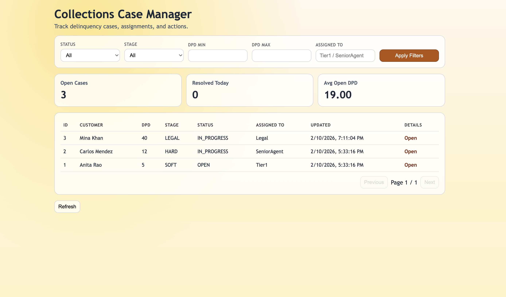
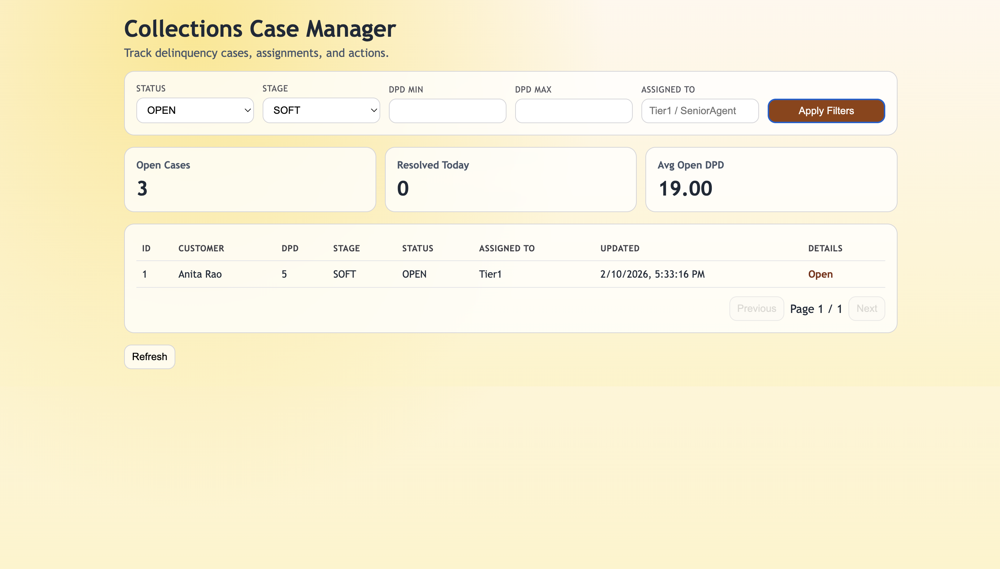
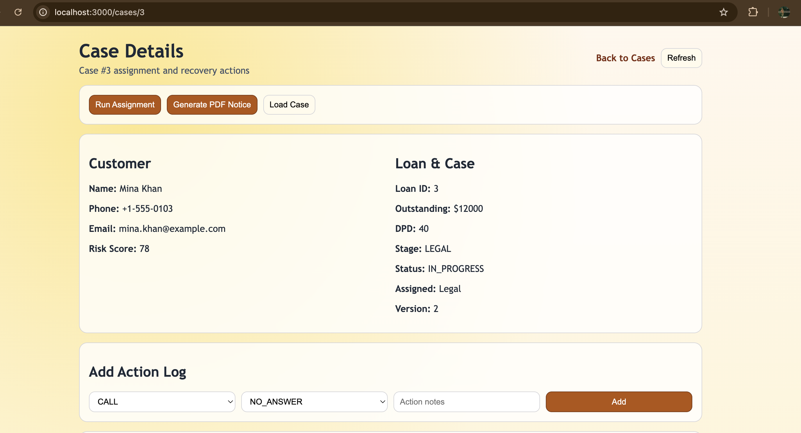
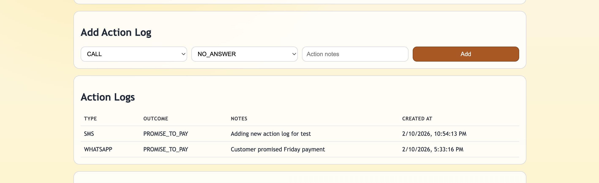
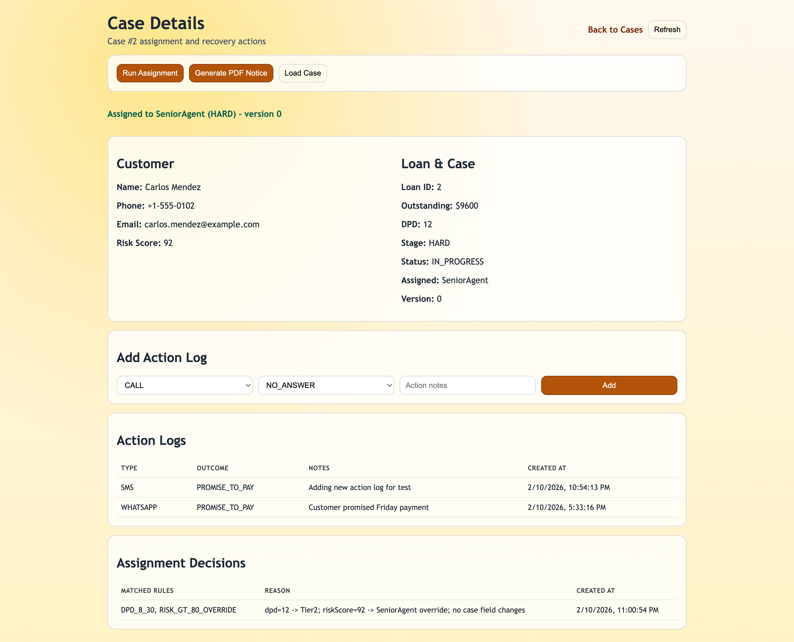
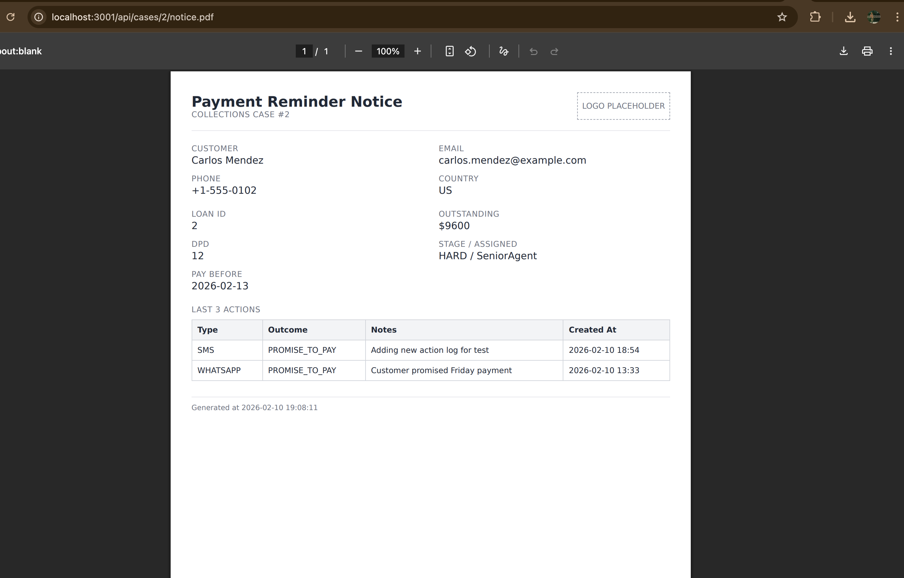
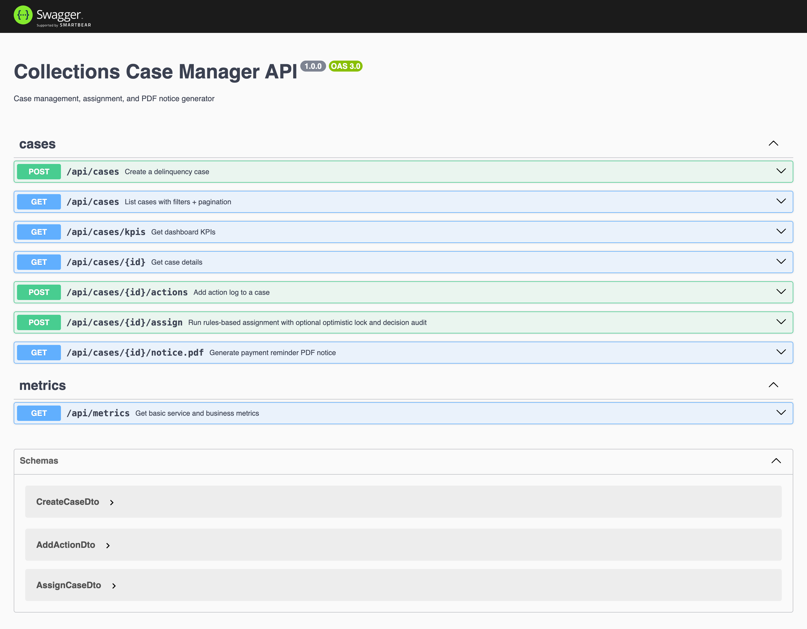
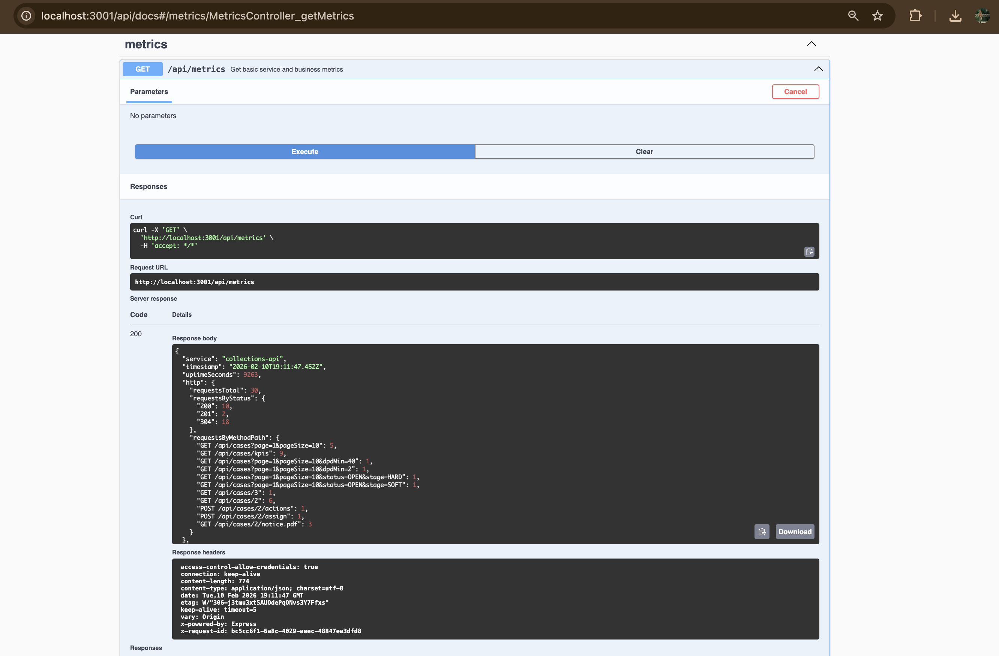

# Collections Case Manager + Rules + PDF Notice Generator

MVP implementation for the senior full-stack take-home assignment.

## MVP Scope
This repository delivers the mandatory assignment scope (case workflow, rules-based assignment with audit trail, dashboard, PDF notice generation, Dockerized run), plus 2 bonus items: optimistic locking/versioning on assignment and a basic metrics endpoint with structured logging.









## Stack
- Backend: NestJS + TypeScript
- Frontend: Next.js (pages router)
- Database: PostgreSQL + Prisma
- PDF: Puppeteer (Chromium)
- Runtime: Docker Compose

## Repo Structure
- `apps/api`: NestJS API, Prisma schema/migration/seed, rules engine, PDF generator
- `apps/web`: Next.js dashboard (`/cases`, `/cases/[id]`)
- `packages/shared`: placeholder workspace package
- `docker-compose.yml`: one-command local run



```bash
curl http://localhost:3001/api/metrics
Output:
 "service":"collections-api","timestamp":"2026-02-10T19:16:52.981Z","uptimeSeconds":9569,"http":{"requestsTotal":31,"requestsByStatus":{"200":11,"201":2,"304":18},"requestsByMethodPath":{"GET /api/cases?page=1&pageSize=10":5,"GET /api/cases/kpis":9,"GET /api/cases?page=1&pageSize=10&dpdMin=40":1,"GET /api/cases?page=1&pageSize=10&dpdMin=2":1,"GET /api/cases?page=1&pageSize=10&status=OPEN&stage=HARD":1,"GET /api/cases?page=1&pageSize=10&status=OPEN&stage=SOFT":1,"GET /api/cases/3":1,"GET /api/cases/2":6,"POST /api/cases/2/actions":1,"POST /api/cases/2/assign":1,"GET /api/cases/2/notice.pdf":3,"GET /api/metrics":1}},"business":{"assignmentRunsTotal":1,"assignmentConflictsTotal":0,"actionLogsCreatedTotal":1},"db":{"totalCases":3,"openCases":3,"totalActionLogs":5,"totalRuleDecisions":13}}%
```
```bash
curl -X POST http://localhost:3001/api/cases/3/assign -H 'Content-Type: application/json' -d '{"expectedVersion":0}'
output:
"success":false,"error":{"statusCode":409,"message":"Assignment conflict: expectedVersion=0, currentVersion=2","details":null,"path":"/api/cases/3/assign","requestId":"e1a4a674-6dca-4e6c-8c93-40b96ac7948d","timestamp":"2026-02-10T19:22:55.007Z"}}%  
```
## Database and Tables:
```bash
docker compose exec db psql -U postgres -d collections -c "\dt"
               List of relations
 Schema |        Name        | Type  |  Owner   
--------+--------------------+-------+----------
 public | _prisma_migrations | table | postgres
 public | action_logs        | table | postgres
 public | cases              | table | postgres
 public | customers          | table | postgres
 public | loans              | table | postgres
 public | rule_decisions     | table | postgres
(6 rows)
```

## What Is Implemented
- Case management workflow:
  - Create case
  - List cases with filters + pagination
  - View case details
  - Add action logs
- Rules-based assignment with audit trail:
  - Rules loaded from `apps/api/src/config/rules.json`
  - Every assignment run stores a `rule_decisions` audit row
  - Stage/assignee/status updates are idempotent (no-op when those fields would not change)
  - Case `version` increments only when assignment changes case state
  - Optimistic locking is supported with `expectedVersion` on assignment
- Dashboard UI:
  - `/cases`: filterable/paginated table + KPI cards
  - `/cases/[id]`: details, action form, run assignment, generate PDF
- PDF payment reminder endpoint:
  - `GET /api/cases/:id/notice.pdf`
  - Includes customer/loan info, DPD/stage/agent, last 3 actions, pay-before date (+3 days), generated timestamp
- Non-functional requirements:
  - DTO validation
  - Consistent error format
  - Stable sorting (`createdAt desc, id desc`)
  - Transactional assignment write
  - Structured request/error logging with request IDs
  - Swagger/OpenAPI docs at `/api/docs`
  - Prisma migration + seed

## PDF Template Note
The PDF intentionally contains a `LOGO PLACEHOLDER` block in the header.

Reason:
- The assignment explicitly requires a header/logo placeholder.
- No brand assets were provided, so a placeholder keeps the template requirement clear and testable.
- In production, replace this block with a real logo image (static asset, URL, or base64 embed).

## Rules Storage and Editing
Rules are JSON-configurable in:
- `apps/api/src/config/rules.json`

Current rules:
- `DPD_1_7`: dpd 1-7 => `SOFT`, `Tier1`
- `DPD_8_30`: dpd 8-30 => `HARD`, `Tier2`
- `DPD_GT_30`: dpd > 30 => `LEGAL`, `Legal`
- `RISK_GT_80_OVERRIDE`: riskScore > 80 => `SeniorAgent` override

To change assignment logic, edit this file and restart the API container.

## Database Model
Prisma schema:
- `Customer`
- `Loan`
- `CollectionCase` (`cases` table)
- `ActionLog` (`action_logs`)
- `RuleDecision` (`rule_decisions`)

Indexes included:
- `cases(status, stage, dpd)`
- `cases(assignedTo)`
- `action_logs(caseId, createdAt)`

## Run with Docker Compose
### Prerequisites
- Docker + Docker Compose

### Start
```bash
docker compose up --build
```

Services:
- Web: `http://localhost:3000`
- API: `http://localhost:3001/api`
- Swagger: `http://localhost:3001/api/docs`
- Postgres: `localhost:5433` (default host mapping)

Notes:
- On startup, API runs Prisma generate + migrate deploy + seed.
- To use a different host port for Postgres, set `POSTGRES_HOST_PORT` before running compose.

## Local Development (without Docker)
### 1) Install
```bash
npm install
```

### 2) Configure env
```bash
cp apps/api/.env.example apps/api/.env
cp apps/web/.env.example apps/web/.env
```

Update `DATABASE_URL` in `apps/api/.env` as needed.

### 3) Run DB migration and seed
```bash
npm run prisma:generate -w apps/api
npm run prisma:migrate -w apps/api
npm run prisma:seed -w apps/api
```

### 4) Start apps
```bash
npm run dev -w apps/api
npm run dev -w apps/web
```

## Run Backend Tests
```bash
npm run test -w apps/api
```

Current backend unit coverage includes:
- Assignment idempotency for unchanged case fields (with audit rows still written)
- Optimistic locking conflict handling (`409` on stale `expectedVersion`)
- Version increment on state-changing assignment
- Action log creation metric increment

## API Endpoints
Required endpoints implemented:
- `POST /api/cases`
- `GET /api/cases`
- `GET /api/cases/:id`
- `POST /api/cases/:id/actions`
- `POST /api/cases/:id/assign`
- `GET /api/cases/:id/notice.pdf`

Additional endpoint for dashboard:
- `GET /api/cases/kpis`

Bonus endpoint:
- `GET /api/metrics`

## Error Format
All API errors return a consistent envelope:
```json
{
  "success": false,
  "error": {
    "statusCode": 400,
    "message": "Validation failed",
    "details": [{ "field": "customerId", "errors": ["customerId must be an integer number"] }],
    "path": "/api/cases",
    "requestId": "56af0a49-88fd-4c57-bf98-c8922e2127de",
    "timestamp": "2026-02-10T12:00:00.000Z"
  }
}
```

## Curl Examples
### Create Case
```bash
curl -X POST http://localhost:3001/api/cases \
  -H 'Content-Type: application/json' \
  -d '{"customerId":1,"loanId":1}'
```

### List Cases with Filters + Pagination
```bash
curl 'http://localhost:3001/api/cases?status=OPEN&stage=HARD&dpdMin=8&dpdMax=30&page=1&pageSize=10'
```

### Case Details
```bash
curl http://localhost:3001/api/cases/1
```

### Add Action
```bash
curl -X POST http://localhost:3001/api/cases/1/actions \
  -H 'Content-Type: application/json' \
  -d '{"type":"CALL","outcome":"PROMISE_TO_PAY","notes":"Customer promised to pay on Friday"}'
```

### Run Assignment
```bash
curl -X POST http://localhost:3001/api/cases/1/assign \
  -H 'Content-Type: application/json' \
  -d '{"expectedVersion":0}'
```

### Metrics
```bash
curl http://localhost:3001/api/metrics
```

### Download PDF Notice
```bash
curl -L http://localhost:3001/api/cases/1/notice.pdf --output notice.pdf
```

## Architecture Decisions / Trade-offs
- Choosen Prisma for faster schema/migration setup and strict typing.
- Kept rule engine intentionally small and deterministic (JSON-configured, no external DSL/runtime).
- Added a dedicated KPI endpoint to keep frontend simple and avoid expensive client aggregation.
- Seed script is idempotent for normal startup: it skips seeding when customer data already exists.
- Assignment behavior is defined as: each run writes an audit record, while case updates are skipped when the computed stage/assignee/status is unchanged.
- Optimistic locking uses a `version` field in `cases`; state-changing assignments increment `version` and stale `expectedVersion` values are rejected with HTTP 409.
- Structured logging is JSON-based for easier tracing and log aggregation.

## Bonus
Implemented:
- Optimistic locking/versioning on assignment.
- Basic metrics endpoint and structured logging.
